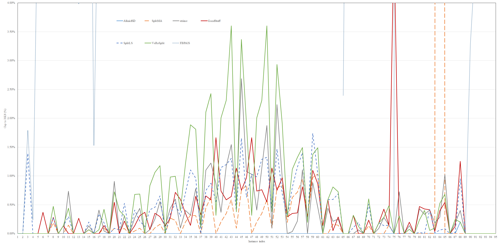
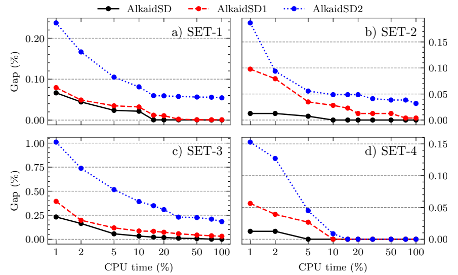
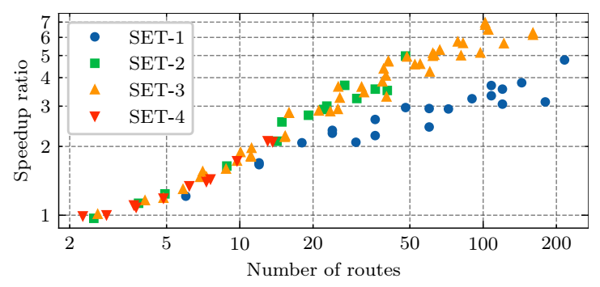

[](https://pubsonline.informs.org/journal/ijoc)

# Alkaid-SDVRP

This archive is distributed in association with the [INFORMS Journal on
Computing](https://pubsonline.informs.org/journal/ijoc) under the [MIT License](LICENSE).

The software and data in this repository are a snapshot of the software and data
that were used in the research reported on in the paper 
[Alkaid-SDVRP: An Efficient Open-Source Solver for the Vehicle Routing Problem with Split Deliveries](https://doi.org/10.1287/ijoc.2024.0606) 
by Weibo Lin, Zhu He, Shibiao Jiang, Fuda Ma, Zhouxing Su, and Zhipeng Lü.
The snapshot is based on 
[this release](https://github.com/HUST-Smart/Alkaid-SDVRP/releases/tag/v1.1) 
in the development repository. 

**Important: This code is being developed on an on-going basis at 
https://github.com/HUST-Smart/Alkaid-SDVRP. Please go there if you would like to
get a more recent version or would like support**

## Cite

To cite the contents of this repository, please cite both the paper and this repo, using their respective DOIs.

https://doi.org/10.1287/ijoc.2024.0606

https://doi.org/10.1287/ijoc.2024.0606.cd

Below is the BibTex for citing this snapshot of the repository.

```
@misc{AlkaidSDVRP,
  author =        {Lin, Weibo and He, Zhu and Jiang, Shibiao and Ma, Fuda and Su, Zhouxing and L\"u, Zhipeng},
  publisher =     {INFORMS Journal on Computing},
  title =         {{Alkaid-SDVRP}: An Efficient Open-Source Solver for the Vehicle Routing Problem with Split Deliveries},
  year =          {2024},
  doi =           {10.1287/ijoc.2024.0606.cd},
  url =           {https://github.com/INFORMSJoC/2024.0606},
  note =          {Available for download at https://github.com/INFORMSJoC/2024.0606}
}
```

## Description

We present Alkaid-SDVRP, an open-source C++ package for efficiently solving the Vehicle Routing Problem with Split Deliveries (SDVRP), a classical combinatorial optimization problem which is a variant of the Capacitated Vehicle Routing Problem where the same customer can be served by multiple vehicles.
The core algorithm of Alkaid-SDVRP is designed based on the Iterated Local Search and Randomized Variable Neighborhood Descent frameworks which are highly configurable and extensible.
Specifically, we implement a number of predefined neighborhoods including $Swap(p, q)$, $Swap^{*}$, $SD$-$Swap^{*}$, $Cross$, $Exchange$, and $Reinsertion$ which can be arbitrarily enabled, disabled, and permuted.
Moreover, it is easy to develop and integrate new neighborhoods into the current framework.
The primary goal of this package is to provide an effective implementation and integration of the state-of-the-art techniques for the SDVRP.
Tested on the 12th DIMACS Implementation Challenge, Alkaid-SDVRP took the first place in the SDVRP track, and has been shown beyond any doubt.
In addition, we hope that the package can facilitate the research for vehicle routing-related problems by providing high-quality baselines and off-the-shelf implementations.

## Building

### Dependencies

The following third-party libraries are used in this project, and an Internet connection is required at configure-time to download them.
- [CPM](https://github.com/cpm-cmake/CPM.cmake)
- [CLI11](https://github.com/CLIUtils/CLI11) (for building the standalone executable only)

### Build and run the standalone target

Use the following command to build and run the executable target.

```bash
cmake -S standalone -B build/standalone
cmake --build build/standalone
./build/standalone/AlkaidSD --help
# run by example config
./build/standalone/AlkaidSD --config example-config.ini
```

### Build the documentation

To manually build documentation, call the following command.

```bash
cmake -S documentation -B build/doc
cmake --build build/doc --target GenerateDocs
# view the docs
open build/doc/doxygen/html/index.html
```

To build the documentation locally, you will need Doxygen, jinja2 and Pygments installed on your system.

## Results

The following table shows the detailed results of the performance of each competitors on each instance in the DIMACS Implementation Challenge 2022 (obtained from the [competition organizers](http://dimacs.rutgers.edu/programs/challenge/vrp/results/)).

|    　    |  AlkaidSD  |        |        |   SplitMA  |        |        |   strime   |        |        |  GoodStuff |        |        |   SplitLS  |        |        |  VeRoSplit |        |        |   FBPAIS   |        |        |
|:--------:|:----------:|:------:|:------:|:----------:|:------:|:------:|:----------:|:------:|:------:|:----------:|:------:|:------:|:----------:|:------:|:------:|:----------:|:------:|:------:|:----------:|:------:|:------:|
| Instance | sol. value |  rank  | points | sol. value |  rank  | points | sol. value |  rank  | points | sol. value |  rank  | points | sol. value |  rank  | points | sol. value |  rank  | points | sol. value |  rank  | points |
|   eil22  |     375    |    1   |  5.43  |     375    |    1   |  5.43  |     375    |    1   |  5.43  |     375    |    1   |  5.43  |     375    |    1   |  5.43  |     375    |    1   |  5.43  |     375    |    1   |  5.43  |
|   eil23  |     569    |    1   |  5.43  |     569    |    1   |  5.43  |     569    |    1   |  5.43  |     569    |    1   |  5.43  |     569    |    1   |  5.43  |     569    |    1   |  5.43  |     569    |    1   |  5.43  |
|   eil30  |     503    |    1   |   6.6  |     503    |    1   |   6.6  |     503    |    1   |   6.6  |     503    |    1   |   6.6  |     510    |    6   |    3   |     503    |    1   |   6.6  |     512    |    7   |    0   |
|   eil33  |     835    |    1   |    6   |     835    |    1   |    6   |     835    |    1   |    6   |     835    |    1   |    6   |     835    |    1   |    6   |     835    |    1   |    6   |     837    |    7   |    0   |
|   eil51  |     521    |    1   |    6   |     521    |    1   |    6   |     521    |    1   |    6   |     521    |    1   |    6   |     521    |    1   |    6   |     521    |    1   |    6   |     552    |    7   |    0   |
|  eilA101 |     814    |    1   |   6.6  |     814    |    1   |   6.6  |     814    |    1   |   6.6  |     817    |    6   |    3   |     814    |    1   |   6.6  |     814    |    1   |   6.6  |     919    |    7   |    0   |
|  eilA76  |     818    |    1   |    6   |     818    |    1   |    6   |     818    |    1   |    6   |     818    |    1   |    6   |     818    |    1   |    6   |     818    |    1   |    6   |     947    |    7   |    0   |
|  eilB101 |    1059    |    1   |    9   |    1061    |    3   |    6   |    1059    |    1   |    9   |    1062    |    4   |   4.5  |    1062    |    4   |   4.5  |    1064    |    6   |    3   |    1190    |    7   |    0   |
|  eilB76  |    1002    |    1   |    6   |    1002    |    1   |    6   |    1002    |    1   |    6   |    1002    |    1   |    6   |    1002    |    1   |    6   |    1002    |    1   |    6   |    1131    |    7   |    0   |
|  eilC76  |     732    |    1   |    8   |     732    |    1   |    8   |     732    |    1   |    8   |     733    |    4   |    4   |     733    |    4   |    4   |     733    |    4   |    4   |     769    |    7   |    0   |
|  eilD76  |     679    |    1   |    9   |     680    |    3   |    6   |     684    |    6   |    3   |     679    |    1   |    9   |     681    |    4   |    5   |     682    |    5   |    4   |     724    |    7   |    0   |
|  p01_00  |     521    |    1   |    6   |     521    |    1   |    6   |     521    |    1   |    6   |     521    |    1   |    6   |     521    |    1   |    6   |     521    |    1   |    6   |     552    |    7   |    0   |
| p01_1030 |     753    |    1   |   6.6  |     753    |    1   |   6.6  |     753    |    1   |   6.6  |     755    |    6   |    3   |     753    |    1   |   6.6  |     753    |    1   |   6.6  |     783    |    7   |    0   |
| p01_1050 |     998    |    1   |    6   |     998    |    1   |    6   |     998    |    1   |    6   |     998    |    1   |    6   |     998    |    1   |    6   |     998    |    1   |    6   |    1062    |    7   |    0   |
| p01_1090 |    1480    |    1   |    9   |    1480    |    1   |    9   |    1482    |    5   |    4   |    1481    |    3   |   5.5  |    1483    |    6   |    3   |    1481    |    3   |   5.5  |    1641    |    7   |    0   |
|  p01_110 |     458    |    1   |    6   |     458    |    1   |    6   |     458    |    1   |    6   |     458    |    1   |    6   |     458    |    1   |    6   |     458    |    1   |    6   |     465    |    7   |    0   |
| p01_3070 |    1473    |    1   |    8   |    1473    |    1   |    8   |    1479    |    6   |    3   |    1473    |    1   |    8   |    1478    |    5   |    4   |    1474    |    4   |    5   |    1577    |    7   |    0   |
| p01_7090 |    2142    |    1   |   10   |    2144    |    3   |    6   |    2143    |    2   |    8   |    2145    |    4   |    5   |    2146    |    5   |    4   |    2151    |    6   |    3   |    2424    |    7   |    0   |
|  p02_00  |     818    |    1   |    6   |     818    |    1   |    6   |     818    |    1   |    6   |     818    |    1   |    6   |     818    |    1   |    6   |     818    |    1   |    6   |     937    |    7   |    0   |
| p02_1030 |    1101    |    1   |   10   |    1102    |    2   |    7   |    1111    |    6   |    3   |    1107    |    4   |    5   |    1102    |    2   |    7   |    1109    |    5   |    4   |    1201    |    7   |    0   |
| p02_1050 |    1491    |    1   |    8   |    1492    |    4   |   4.5  |    1491    |    1   |    8   |    1491    |    1   |    8   |    1492    |    4   |   4.5  |    1497    |    6   |    3   |    1626    |    7   |    0   |
| p02_1090 |    2284    |    1   |   10   |    2286    |    2   |    8   |    2291    |    4   |   4.5  |    2289    |    3   |    6   |    2296    |    6   |    3   |    2291    |    4   |   4.5  |    2590    |    7   |    0   |
|  p02_110 |     612    |    1   |    6   |     612    |    1   |    6   |     612    |    1   |    6   |     612    |    1   |    6   |     612    |    1   |    6   |     612    |    1   |    6   |     674    |    7   |    0   |
| p02_3070 |    2206    |    1   |   10   |    2207    |    2   |    8   |    2212    |    4   |    5   |    2209    |    3   |    6   |    2215    |    5   |    4   |    2221    |    6   |    3   |    2491    |    7   |    0   |
| p02_7090 |    3198    |    1   |   10   |    3201    |    2   |    8   |    3212    |    5   |    4   |    3208    |    4   |    5   |    3205    |    3   |    6   |    3220    |    6   |    3   |    3840    |    7   |    0   |
|  p03_00  |     814    |    1   |  7.25  |     814    |    1   |  7.25  |     814    |    1   |  7.25  |     817    |    6   |    3   |     815    |    5   |    4   |     814    |    1   |  7.25  |     913    |    7   |    0   |
| p03_1030 |    1441    |    1   |    9   |    1441    |    1   |    9   |    1442    |    3   |   5.5  |    1442    |    3   |   5.5  |    1447    |    5   |    4   |    1453    |    6   |    3   |    1609    |    7   |    0   |
| p03_1050 |    1976    |    1   |   10   |    1978    |    2   |    8   |    1981    |    3   |    6   |    1983    |    4   |    5   |    1985    |    5   |    4   |    1997    |    6   |    3   |    2253    |    7   |    0   |
| p03_1090 |    3051    |    1   |   10   |    3056    |    2   |    8   |    3068    |    4   |    5   |    3060    |    3   |    6   |    3071    |    5   |    4   |    3087    |    6   |    3   |    3463    |    7   |    0   |
|  p03_110 |     749    |    1   |  7.25  |     749    |    1   |  7.25  |     750    |    5   |   3.5  |     750    |    5   |   3.5  |     749    |    1   |  7.25  |     749    |    1   |  7.25  |     913    |    7   |    0   |
| p03_3070 |    2956    |    1   |   10   |    2964    |    2   |    7   |    2969    |    5   |    4   |    2964    |    2   |    7   |    2966    |    4   |    5   |    2985    |    6   |    3   |    3350    |    7   |    0   |
| p03_7090 |    4331    |    1   |   10   |    4341    |    2   |    8   |    4357    |    4   |    5   |    4362    |    5   |    4   |    4354    |    3   |    6   |    4374    |    6   |    3   |    5198    |    7   |    0   |
|  p04_00  |    1008    |    1   |    9   |    1008    |    1   |    9   |    1009    |    3   |    6   |    1014    |    6   |    3   |    1011    |    4   |    5   |    1012    |    5   |    4   |      x     |    7   |    0   |
| p04_1030 |    1988    |    1   |   10   |    1992    |    2   |    8   |    1996    |    4   |    5   |    1995    |    3   |    6   |    2002    |    5   |    4   |    2012    |    6   |    3   |      x     |    7   |    0   |
| p04_1050 |    2808    |    1   |   10   |    2817    |    3   |   5.5  |    2817    |    3   |   5.5  |    2812    |    2   |    8   |    2839    |    5   |    4   |    2861    |    6   |    3   |      x     |    7   |    0   |
| p04_1090 |    4474    |    1   |   10   |    4488    |    2   |    8   |    4509    |    4   |    5   |    4503    |    3   |    6   |    4517    |    5   |    4   |    4555    |    6   |    3   |      x     |    7   |    0   |
|  p04_110 |     909    |    1   |    8   |     909    |    1   |    8   |     910    |    4   |   4.5  |     912    |    6   |    3   |     909    |    1   |    8   |     910    |    4   |   4.5  |      x     |    7   |    0   |
| p04_3070 |    4273    |    1   |   10   |    4292    |    2   |    8   |    4320    |    5   |    4   |    4301    |    3   |    6   |    4305    |    4   |    5   |    4363    |    6   |    3   |      x     |    7   |    0   |
| p04_7090 |    6300    |    1   |   10   |    6340    |    3   |    6   |    6377    |    5   |    4   |    6337    |    2   |    8   |    6355    |    4   |    5   |    6453    |    6   |    3   |      x     |    7   |    0   |
|  p05_00  |    1262    |    1   |    9   |    1262    |    1   |    9   |    1273    |    5   |    4   |    1283    |    6   |    3   |    1269    |    4   |    5   |    1266    |    3   |    6   |      x     |    7   |    0   |
| p05_1030 |    2442    |    1   |   10   |    2447    |    2   |    8   |    2451    |    3   |    6   |    2460    |    4   |    5   |    2470    |    5   |    4   |    2491    |    6   |    3   |      x     |    7   |    0   |
| p05_1050 |    3419    |    1   |   10   |    3431    |    2   |    8   |    3459    |    4   |    5   |    3439    |    3   |    6   |    3460    |    5   |    4   |    3498    |    6   |    3   |      x     |    7   |    0   |
| p05_1090 |    5442    |    1   |   10   |    5474    |    2   |    8   |    5526    |    5   |    4   |    5477    |    3   |    6   |    5513    |    4   |    5   |    5638    |    6   |    3   |      x     |    7   |    0   |
|  p05_110 |    1055    |    1   |   10   |    1056    |    2   |    8   |    1061    |    5   |    4   |    1067    |    6   |    3   |    1059    |    3   |   5.5  |    1059    |    3   |   5.5  |      x     |    7   |    0   |
| p05_3070 |    5320    |    1   |   10   |    5360    |    2   |    7   |    5463    |    5   |    4   |    5360    |    2   |    7   |    5408    |    4   |    5   |    5499    |    6   |    3   |      x     |    7   |    0   |
| p05_7090 |    8069    |    1   |   10   |    8137    |    3   |    6   |    8156    |    5   |    4   |    8147    |    4   |    5   |    8120    |    2   |    8   |    8223    |    6   |    3   |      x     |    7   |    0   |
|  p10_00  |    1262    |    1   |    9   |    1262    |    1   |    9   |    1275    |    4   |   4.5  |    1283    |    6   |    3   |    1275    |    4   |   4.5  |    1266    |    3   |    6   |      x     |    7   |    0   |
| p10_1030 |    2442    |    1   |   10   |    2447    |    2   |    8   |    2452    |    3   |    6   |    2460    |    4   |    5   |    2466    |    5   |    4   |    2491    |    6   |    3   |      x     |    7   |    0   |
| p10_1050 |    3419    |    1   |   10   |    3431    |    2   |    8   |    3458    |    4   |    5   |    3445    |    3   |    6   |    3463    |    5   |    4   |    3498    |    6   |    3   |      x     |    7   |    0   |
| p10_1090 |    5442    |    1   |   10   |    5474    |    3   |    6   |    5544    |    5   |    4   |    5472    |    2   |    8   |    5514    |    4   |    5   |    5638    |    6   |    3   |      x     |    7   |    0   |
|  p10_110 |    1055    |    1   |   10   |    1056    |    2   |    7   |    1056    |    2   |    7   |    1067    |    6   |    3   |    1059    |    4   |   4.5  |    1059    |    4   |   4.5  |      x     |    7   |    0   |
| p10_3070 |    5320    |    1   |   10   |    5362    |    3   |    6   |    5439    |    5   |    4   |    5360    |    2   |    8   |    5398    |    4   |    5   |    5476    |    6   |    3   |      x     |    7   |    0   |
| p10_7090 |    8069    |    1   |   10   |    8137    |    3   |    6   |    8147    |    4   |   4.5  |    8147    |    4   |   4.5  |    8125    |    2   |    8   |    8223    |    6   |    3   |      x     |    7   |    0   |
|  p11_00  |    1023    |    1   |    9   |    1025    |    3   |    6   |    1023    |    1   |    9   |    1026    |    4   |    4   |    1026    |    4   |    4   |    1026    |    4   |    4   |      x     |    7   |    0   |
| p11_1030 |    2862    |    1   |   10   |    2880    |    4   |    5   |    2863    |    2   |    8   |    2872    |    3   |    6   |    2885    |    5   |    4   |    2894    |    6   |    3   |      x     |    7   |    0   |
| p11_1050 |    4166    |    1   |   10   |    4196    |    4   |    5   |    4175    |    2   |    8   |    4181    |    3   |    6   |    4214    |    5   |    4   |    4221    |    6   |    3   |      x     |    7   |    0   |
| p11_1090 |    6764    |    1   |   10   |    6828    |    3   |    6   |    6839    |    4   |    5   |    6819    |    2   |    8   |    6859    |    5   |    4   |    6865    |    6   |    3   |      x     |    7   |    0   |
|  p11_110 |    1028    |    1   |    9   |    1031    |    5   |   3.5  |    1028    |    1   |    9   |    1031    |    5   |   3.5  |    1030    |    3   |   5.5  |    1030    |    3   |   5.5  |      x     |    7   |    0   |
| p11_3070 |    6556    |    1   |   10   |    6620    |    3   |    6   |    6614    |    2   |    8   |    6628    |    4   |    5   |    6670    |    6   |    3   |    6646    |    5   |    4   |      x     |    7   |    0   |
| p11_7090 |    10068   |    1   |   10   |    10172   |    4   |    5   |    10114   |    2   |    8   |    10155   |    3   |    6   |    10173   |    5   |    4   |    10218   |    6   |    3   |      x     |    7   |    0   |
|  S101D1  |     716    |    1   |   6.6  |     716    |    1   |   6.6  |     716    |    1   |   6.6  |     717    |    6   |    3   |     716    |    1   |   6.6  |     716    |    1   |   6.6  |     940    |    7   |    0   |
|  S101D2  |    1360    |    1   |    9   |    1360    |    1   |    9   |    1366    |    3   |    6   |    1368    |    4   |    4   |    1368    |    4   |    4   |    1368    |    4   |    4   |    1556    |    7   |    0   |
|  S101D3  |    1854    |    1   |   10   |    1857    |    3   |    6   |    1858    |    4   |    5   |    1855    |    2   |    8   |    1865    |    5   |    4   |    1869    |    6   |    3   |    2133    |    7   |    0   |
|  S101D5  |    2758    |    1   |   10   |    2762    |    2   |    8   |    2765    |    3   |    6   |    2766    |    4   |    5   |    2777    |    5   |    4   |    2778    |    6   |    3   |      x     |    7   |    0   |
|   S51D1  |     458    |    1   |    6   |     458    |    1   |    6   |     458    |    1   |    6   |     458    |    1   |    6   |     458    |    1   |    6   |     458    |    1   |    6   |     469    |    7   |    0   |
|   S51D2  |     703    |    1   |    6   |     703    |    1   |    6   |     703    |    1   |    6   |     703    |    1   |    6   |     703    |    1   |    6   |     703    |    1   |    6   |     793    |    7   |    0   |
|   S51D3  |     942    |    1   |    8   |     942    |    1   |    8   |     942    |    1   |    8   |     945    |    5   |   3.5  |     943    |    4   |    5   |     945    |    5   |   3.5  |     983    |    7   |    0   |
|   S51D4  |    1551    |    1   |    8   |    1551    |    1   |    8   |    1552    |    4   |    5   |    1551    |    1   |    8   |    1554    |    6   |    3   |    1553    |    5   |    4   |    1826    |    7   |    0   |
|   S51D5  |    1328    |    1   |    6   |    1328    |    1   |    6   |    1328    |    1   |    6   |    1328    |    1   |    6   |    1328    |    1   |    6   |    1328    |    1   |    6   |    1454    |    7   |    0   |
|   S51D6  |    2153    |    1   |    9   |    2156    |    3   |    6   |    2153    |    1   |    9   |    2158    |    4   |    5   |    2164    |    5   |    4   |    2166    |    6   |    3   |    2513    |    7   |    0   |
|   S76D1  |     592    |    1   |    6   |     592    |    1   |    6   |     592    |    1   |    6   |     592    |    1   |    6   |     592    |    1   |    6   |     592    |    1   |    6   |     684    |    7   |    0   |
|   S76D2  |    1080    |    1   |    9   |    1080    |    1   |    9   |    1081    |    3   |    6   |    1082    |    4   |    4   |    1082    |    4   |    4   |    1082    |    4   |    4   |    1289    |    7   |    0   |
|   S76D3  |    1418    |    1   |    9   |    1418    |    1   |    9   |    1422    |    4   |   4.5  |    1424    |    6   |    3   |    1420    |    3   |    6   |    1422    |    4   |   4.5  |    1526    |    7   |    0   |
|   S76D4  |    2068    |    1   |   10   |    2071    |    2   |  5.75  |    2071    |    2   |  5.75  |    2071    |    2   |  5.75  |    2071    |    2   |  5.75  |    2078    |    6   |    3   |    2244    |    7   |    0   |
|    SD1   |    22828   |    1   |    6   |    22828   |    1   |    6   |    22828   |    1   |    6   |    24000   |    7   |    0   |    22828   |    1   |    6   |    22828   |    1   |    6   |    22828   |    1   |    6   |
|   SD10   |   268473   |    1   |   10   |   268481   |    3   |   5.5  |   270425   |    6   |    3   |   268475   |    2   |    8   |   268481   |    3   |   5.5  |   269300   |    5   |    4   |      x     |    7   |    0   |
|   SD11   |   1328000  |    1   |    6   |   1328000  |    1   |    6   |   1328000  |    1   |    6   |   1328000  |    1   |    6   |   1328000  |    1   |    6   |   1328000  |    1   |    6   |      x     |    7   |    0   |
|   SD12   |   721353   |    1   |   10   |   721362   |    3   |    6   |   722358   |    5   |    4   |   722788   |    6   |    3   |   721361   |    2   |    8   |   721900   |    4   |    5   |   814185   |    7   |    0   |
|   SD13   |   1011040  |    1   |    8   |   1011050  |    5   |    4   |   1011040  |    1   |    8   |   1011047  |    4   |    5   |   1011053  |    6   |    3   |   1011040  |    1   |    8   |      x     |    7   |    0   |
|   SD14   |   1071550  |    1   |    9   |   1071550  |    1   |    9   |   1076179  |    5   |    4   |   1076583  |    6   |    3   |   1071748  |    3   |    6   |   1074100  |    4   |    5   |      x     |    7   |    0   |
|   SD15   |   1508948  |    1   |   10   |   1508950  |    2   |    8   |   1514000  |    4   |    5   |   1515400  |    6   |    3   |   1508998  |    3   |    6   |   1515000  |    5   |    4   |      x     |    7   |    0   |
|   SD16   |   338109   |    1   |   10   |   338129   |    2   |    8   |   339495   |    4   |    5   |   339513   |    5   |    4   |   339516   |    6   |    3   |   338300   |    3   |    6   |      x     |    7   |    0   |
|   SD17   |   2649273  |    1   |   10   |   2649348  |    2   |    8   |   2654252  |    6   |    3   |   2650316  |    4   |    5   |   2649599  |    3   |    6   |   2651900  |    5   |    4   |      x     |    7   |    0   |
|   SD18   |   1419369  |    1   |   10   |      x     |    7   |   2.5  |   1423441  |    3   |    6   |   1425034  |    4   |    5   |   1420229  |    2   |    8   |   1426800  |    5   |    4   |      x     |    7   |   2.5  |
|   SD19   |   1998716  |    1   |   10   |   1998850  |    2   |    8   |   2019145  |    6   |    3   |   2009507  |    4   |    5   |   2000430  |    3   |    6   |   2012400  |    5   |    4   |      x     |    7   |    0   |
|    SD2   |    70828   |    1   |    6   |    70828   |    1   |    6   |    70828   |    1   |    6   |    70828   |    1   |    6   |    70828   |    1   |    6   |    70828   |    1   |    6   |    74828   |    7   |    0   |
|   SD20   |   3963513  |    1   |   10   |   3963541  |    2   |    8   |   3970862  |    5   |    4   |   3968513  |    4   |    5   |   3964330  |    3   |    6   |   3973300  |    6   |    3   |      x     |    7   |    0   |
|   SD21   |   1129352  |    2   |    7   |   1127095  |    1   |   10   |   1131639  |    4   |    5   |   1141199  |    6   |    3   |   1137842  |    5   |    4   |   1129352  |    2   |    7   |      x     |    7   |    0   |
|    SD3   |    43060   |    1   |  5.43  |    43060   |    1   |  5.43  |    43060   |    1   |  5.43  |    43060   |    1   |  5.43  |    43060   |    1   |  5.43  |    43060   |    1   |  5.43  |    43060   |    1   |  5.43  |
|    SD4   |    63108   |    1   |    6   |    63108   |    1   |    6   |    63108   |    1   |    6   |    63108   |    1   |    6   |    63108   |    1   |    6   |    63108   |    1   |    6   |    65175   |    7   |    0   |
|    SD5   |   139059   |    1   |    6   |   139059   |    1   |    6   |   139059   |    1   |    6   |   139059   |    1   |    6   |   139059   |    1   |    6   |   139059   |    1   |    6   |   145735   |    7   |    0   |
|    SD6   |    83120   |    1   |    6   |    83120   |    1   |    6   |    83120   |    1   |    6   |    83120   |    1   |    6   |    83120   |    1   |    6   |    83120   |    1   |    6   |    86836   |    7   |    0   |
|    SD7   |   364000   |    1   |    6   |   364000   |    1   |    6   |   364000   |    1   |    6   |   364000   |    1   |    6   |   364000   |    1   |    6   |   364000   |    1   |    6   |   392550   |    7   |    0   |
|    SD8   |   506828   |    1   |    6   |   506828   |    1   |    6   |   506828   |    1   |    6   |   506828   |    1   |    6   |   506828   |    1   |    6   |   506828   |    1   |    6   |   556293   |    7   |    0   |
|    SD9   |   204424   |    1   |    6   |   204424   |    1   |    6   |   204424   |    1   |    6   |   204424   |    1   |    6   |   204424   |    1   |    6   |   204424   |    1   |    6   |   220171   |    7   |    0   |
|          |     　     |    1   | 798.19 |     　     |    2   | 646.44 |     　     |    3   | 530.69 |     　     |    3   | 504.14 |     　     |    4   | 490.59 |     　     |    4   | 433.19 |     　     |    7   |  24.79 |
|          |     　     | Median |  Total |     　     | Median |  Total |     　     | Median |  Total |     　     | Median |  Total |     　     | Median |  Total |     　     | Median |  Total |     　     | Median |  Total |

Figure 4 in the paper depicts the overall results in the DIMACS Implementation Challenge 2022.



The following two figures shows the effectiveness of the algorithm components.

The first one compares two alternative algorithms where AlkaidSD1 utilizes SD-Swap(1, 1) and SD-Swap(1, 2) instead of SD-Swap∗ operator. AlkaidSD2 utilizes Multiple-k-Split (Silva MM, Subramanian A, Ochi LS, 2015) instead of our perturbation mechanism.



The second one displays the speedup ratio brought by LSMD on instances of different types.



## Replicating

To replicate the results in the DIMACS Implementation Challenge 2022, do either

```
./alkaid-sd --input data/SET-1/SD21.txt --output solution.txt --time-limit 1800 --blink-rate 0.021 --inter-operators Relocate --intra-operators Exchange --acceptance-rule-type LAHC --acceptance-rule-args length=83 --ruin-method-type Random --ruin-method-args 4 --sorters random=0.078
```
or
```
./alkaid-sd --config example-config.ini
```

For the explanations for the CLI arguments or the configuration file format, please refer to the following example of configuration file:

```ini
; Specifies the path to the problem input file.
input = data/SET-1/SD21.txt

; Specifies the name of the output file where the solution will be written.
output = solution.txt

; Sets the seed value for the random number generator used by the algorithm.
random-seed = 42

; Specifies the maximum time limit (in seconds) for the algorithm to run.
time-limit = 1800

; Sets the blink rate for the SplitReinsertion process.
blink-rate = 0.021

; Specifies the list of inter-route operators to be used by the algorithm.
; Possible inter-route operators are:
;   - Swap<2, 0>
;   - Swap<2, 1>
;   - Swap<2, 2>
;   - Relocate
;   - SwapStar
;   - Cross
;   - SdSwapStar
;   - SdSwapOneOne
;   - SdSwapTwoOne
inter-operators = ["Relocate", "Swap<2, 0>", "Swap<2, 1>", "Swap<2, 2>", "Cross", "SwapStar", "SdSwapStar"]

; Specifies the list of intra-route operators to be used by the algorithm.
; Possible intra-route operators are:
;   - Exchange
;   - OrOpt<1>
;   - OrOpt<2>
;   - OrOpt<3>
intra-operators = ["Exchange", "OrOpt<1>"]

; Specifies the type and arguments of acceptance rule to be used by the algorithm.
; Possible acceptance rules are:
;   - HC: Hill Climbing
;   - HCWE: Hill Climbing With Equal
;   - LAHC: Late Acceptance Hill Climbing
;     - length: the length of the history list.
;   - SA: Simulated Annealing
;     - initial_temperature: the initial temperature.
;     - decay: the decay rate.
acceptance-rule-type = "LAHC"
acceptance-rule-args = ["length=83"]

; Specifies the type and arguments of ruin method to be used by the algorithm.
; Possible ruin methods are:
;   - SISRs: Slack Induction by String Removals
;     - average_customers: the average number of customers to be removed.
;     - max_length: the maximum length of the route to be removed.
;     - split_rate: the split rate.
;     - preserved_probability: the probability of preserving a node.
;   - Random: Random Ruin
;     - args are integer values representing all possible ruin sizes.
ruin-method-type = "SISRs"
ruin-method-args = ["average_customers=36", "max_length=8", "split_rate=0.740", "preserved_probability=0.096"]

; Specifies the list of sorters to be used by the perturbation process.
; Possible sorters are:
;   - random: randomly shuffles customers.
;   - demand: sorts customers based on their demand in descending order.
;   - far: sorts customers based on their distance to the depot in descending order.
;   - close: sorts customers based on their distance to the depot in increasing order.
sorters = ["random=0.078", "demand=0.225", "far=0.942", "close=0.120"]
```

## Ongoing Development

This code is being developed on an on-going basis at the author's
[Github site](https://github.com/HUST-Smart/Alkaid-SDVRP).

## Support

For support in using this software, submit an
[issue](https://github.com/HUST-Smart/Alkaid-SDVRP/issues/new).
